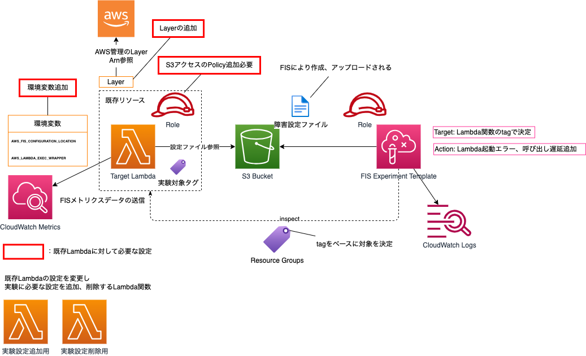

# aws-cdk-utilities

## FIS Lambda用実験テンプレート

### FIS Lambda実験準備用Lambda関数実行

aws lambda invoke --function-name dev-kasio-base-stack-fis-lambda-setup \
 --cli-binary-format raw-in-base64-out \
 --payload '{"targetLambdaName": "dev-kasio-lambda-stack-LambdaFunc4144DB58-zjsfDbtPh7Ps"}' response.json

### FIS Lambda実験設定削除用Lambda関数実行

aws lambda invoke --function-name dev-kasio-base-stack-fis-lambda-cleanup \
 --cli-binary-format raw-in-base64-out \
 --payload '{"targetLambdaName": "dev-kasio-lambda-stack-LambdaFunc4144DB58-zjsfDbtPh7Ps"}' response.json
